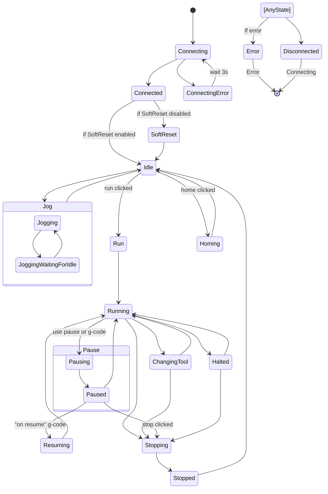

# Application States

AstroCore uses a clear state machine to manage application and machine states. Transitions between states are triggered by events such as machine state changes or user actions.

## State diagram

