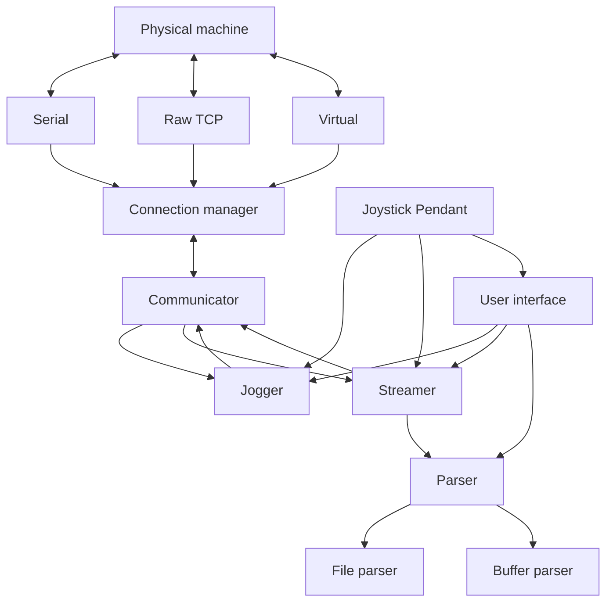

# Architecture Overview

AstroCore is being refactored into a modular architecture. One of the main goals is to clearly separate the user interface from the machine control logic.

This brings several advantages:

- Better transparency and maintainability of the code
- Ability to change the UI quickly, even in a different technology
- Easier support for new communication methods
- Easier addition of new features
- Easier testing

## High-level diagram

