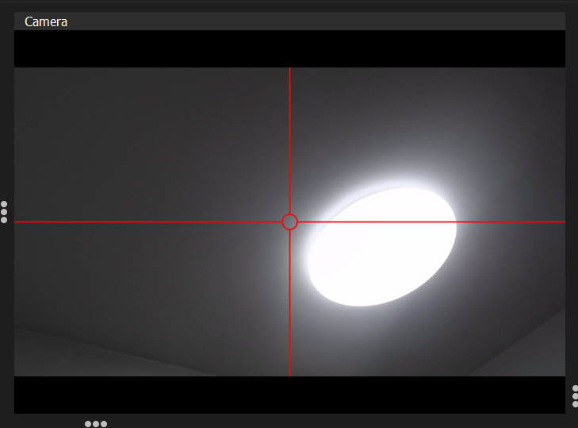

# Camera

The camera panel shows a live video feed from a connected camera (for example a USB webcam mounted on the machine). It helps you line up the tool with a point on the workpiece, check the work area, or watch the job while it runs.

## Selecting a camera

Right-click on the camera view to open its menu. The menu lists all cameras detected on your computer. Pick one to start the video feed, or choose **Disable** to turn the camera off.

If no camera is found, the view shows a **"No camera found"** message.

## Crosshair

A crosshair (target) can be drawn on top of the video feed to mark the exact center of the view. This makes it easier to position the tool precisely over a point on the workpiece.

Right-click on the camera view and open the **Crosshair** submenu to choose a style:

- **None** — no crosshair (the video is shown without any overlay)
- **Cross** — full lines crossing the whole view
- **Cross with gap** — lines with a small gap in the middle and a circle at the center
- **Dot** — a single dot marking the center point
- **Circle with ticks** — a center circle with short marks around it

The crosshair scales with the video resolution, so it stays clearly visible on both low- and high-resolution cameras. Your choice is remembered and used again the next time you start the application.
