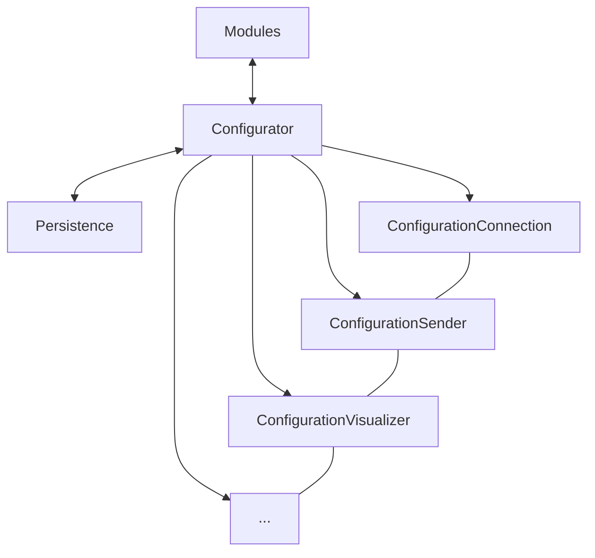

# Configuration System

The configuration system is being redesigned as a separate module. The goal is to make settings easier to manage, extend and store.

## Design goals

- Wrap related settings into separate classes
- Automate reading and writing of configuration fields where possible
- Separate persistence layer from configuration logic
- Allow storing configuration locally and in the cloud (for example Dropbox or Google Drive)

## Concept diagram

