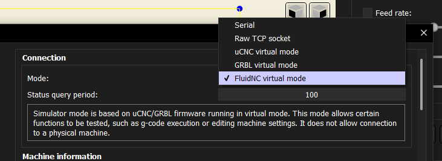

# Connection and Virtual Modes

AstroCore supports several connection modes, including virtual modes that do not require real hardware.

## Supported connection modes

- **Serial port** – classic GRBL-style serial connection
- **Raw TCP** – uses the same protocol as serial port, without extra handshaking
- **uCNC virtual mode** – no real hardware required
- **grblHAL virtual mode** – no real hardware required
- **FluidNC virtual mode** – no real hardware required

These virtual modes allow you to test and experiment without connecting to a real CNC machine.

## Screenshot

Connection modes selection:

