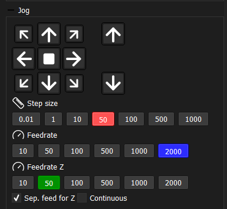
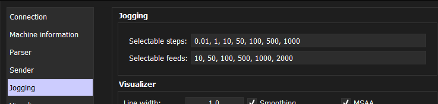

# Jogging

Jogging allows manual movement of the CNC machine axes directly from the application, without sending a G-code program. This is useful for positioning the machine, setting work coordinates, or inspecting the workpiece.

## Axes and directions

- **XY axes** — movement in 8 directions: along X, along Y, and diagonally (4 diagonal combinations)
- **Z axis** — movement up or down

## Movement modes

**Continuous** — the machine moves for as long as the button is held down.

**Step** — the machine moves by a fixed distance with each button press. The step size is selected from a configurable set of values (e.g. 0.1, 1, 10 mm).

## Jog panel

All jogging controls and parameters are located in a single panel:

- Direction buttons for XY and Z
- Mode toggle (continuous / step)
- Step size selection (active when step mode is on)
- Feed rate for XY axes
- Feed rate for Z axis (optional, see below)

## Separate Z feed rate

The Z axis often requires more careful and precise movement than XY — for example, when probing the workpiece surface or approaching a fragile tool. For this reason, a separate feed rate can be configured for Z. When enabled, Z movements use their own speed setting independent of the XY feed rate.

