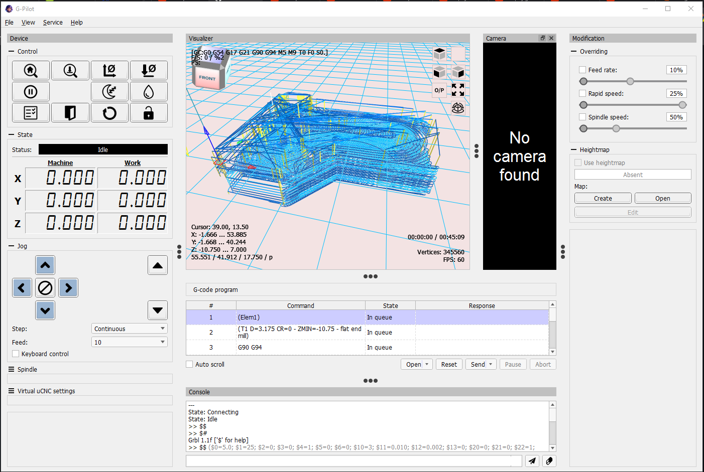
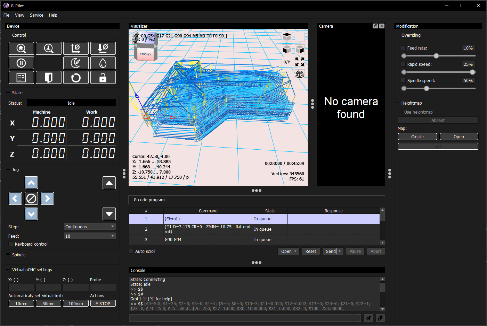
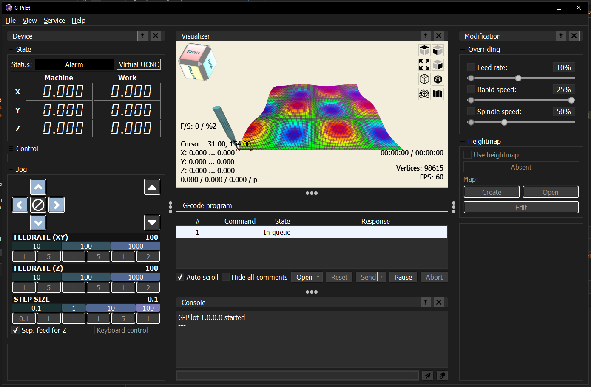
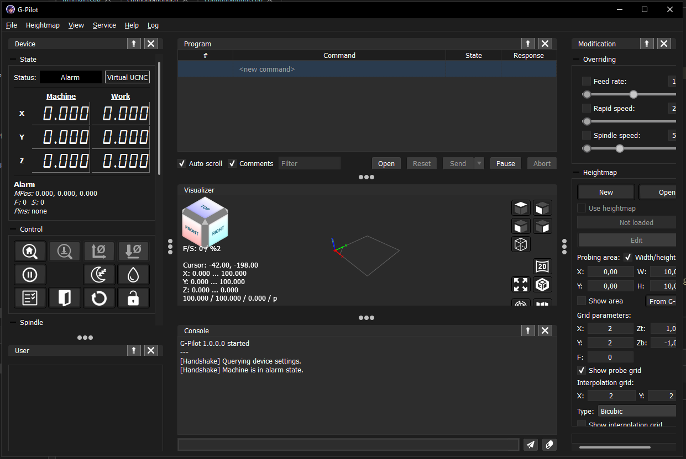
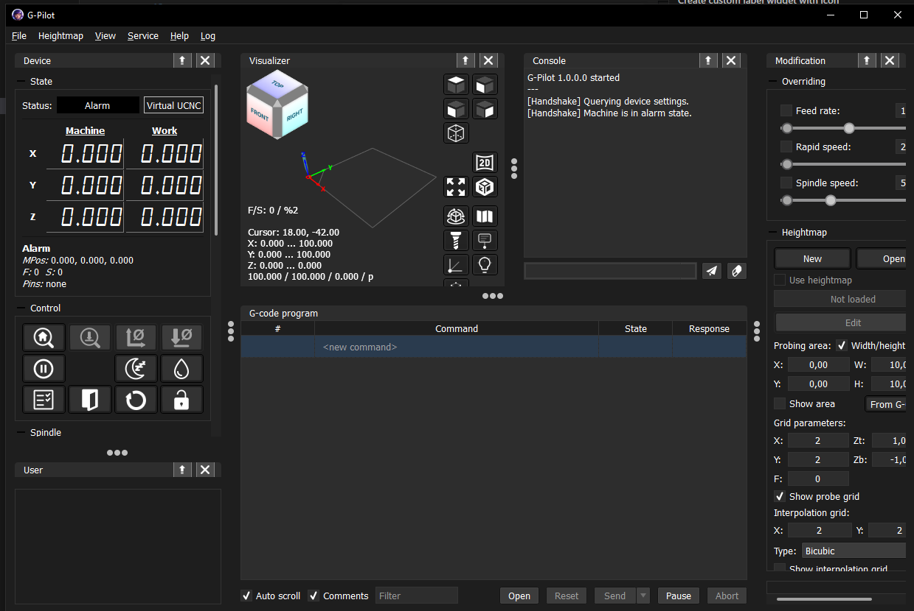

# User Interface

The main user interface is a single window that contains all controls needed to operate the CNC machine. You can see the loaded G-code program, a 3D visualizer, machine state, heightmap tools and other important controls in one place.

The layout is designed to be clear and easy to use, so you can quickly access every function you need.

## Interface scaling

You can change the size of interface elements to fit your screen:

- Scale from 80% to 140%
- Equivalent to font sizes from 8 to 14
- Scale can be changed in the settings panel, in the `View` menu, or using keyboard shortcuts `Ctrl+` and `Ctrl-`

Scale changes take effect immediately, so you can quickly find a comfortable size.

## Screenshots

Main window (light theme):

Dark mode:

New style dark mode (scaled view):

Heightmap preview:

## Layout and docking windows

Most panels can be freely moved, resized, detached from the main window, or stacked on top of each other. The docking system requires one fixed **central widget** — the panel that always occupies the center and cannot be detached or closed. To give you more flexibility over which panel takes that prominent role, AstroCore lets you switch the central widget between the **Visualizer** and the **Program** panel. The setting is in the **View > Central Widget** menu.

**Visualizer as central widget:**

**Program as central widget:**

