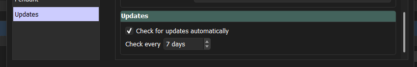
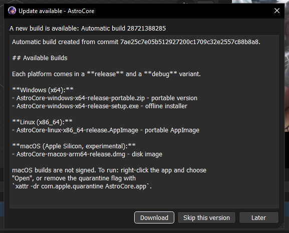

# Checking for updates

AstroCore can tell you when a newer build is available. It checks the official
release list on GitHub and lets you decide what to do next. AstroCore never
downloads or installs anything on its own — when an update is available it simply
points you to the release page in your web browser.

## Automatic checking

By default AstroCore checks for updates in the background, every few days, shortly
after the application starts. If nothing new is found, you will not be disturbed —
the check is silent unless a newer build is available.

You can turn automatic checking on or off, and change how often it runs, in
**Settings → Updates**.

- **Check for updates automatically** – turns background checking on or off.
- **Check every N days** – how often the background check may run (1–365 days).

## Checking manually

You can check for updates at any time from the main window menu:

**Help → Check for updates…**

A manual check always tells you the result, even when you already have the latest
build. This is also the way to see a version you previously chose to skip.

## When an update is available

Whether the check was automatic or manual, AstroCore shows the same dialog with a
short description of the new build and its release notes.

You have three choices:

- **Download** – opens the release page on GitHub in your web browser, where you
  can pick the file for your platform (Windows, Linux or macOS).
- **Skip this version** – hides this particular build. Automatic checks will no
  longer notify you about it, but a manual check still shows it.
- **Later** – closes the dialog and does nothing. You will be reminded again on
  the next automatic check.

## How AstroCore knows its version

AstroCore builds are produced automatically and each one gets a unique, increasing
build number. AstroCore compares the build number it was compiled with against the
newest build published on GitHub. If the published build number is higher, an
update is offered.

Because of this, builds you compile yourself (for example from source, during
development) have no build number and are treated as "development" builds — for
these, automatic checking is disabled so you are not notified about every release.

AstroCore remembers when it last checked, which build it last saw, and which build
you chose to skip, so it can behave sensibly between runs.

## Privacy

An update check contacts GitHub over the internet to read the public list of
releases. No personal data is sent and no account is required. If you prefer,
you can disable automatic checking in **Settings → Updates** and only check
manually when you want to.

## See also

- [Configuration system](configuration.md) – How settings are stored
- [Build and packaging](build.md) – How AstroCore builds are produced
- [Help and bug reports](help.md) – How to report issues
