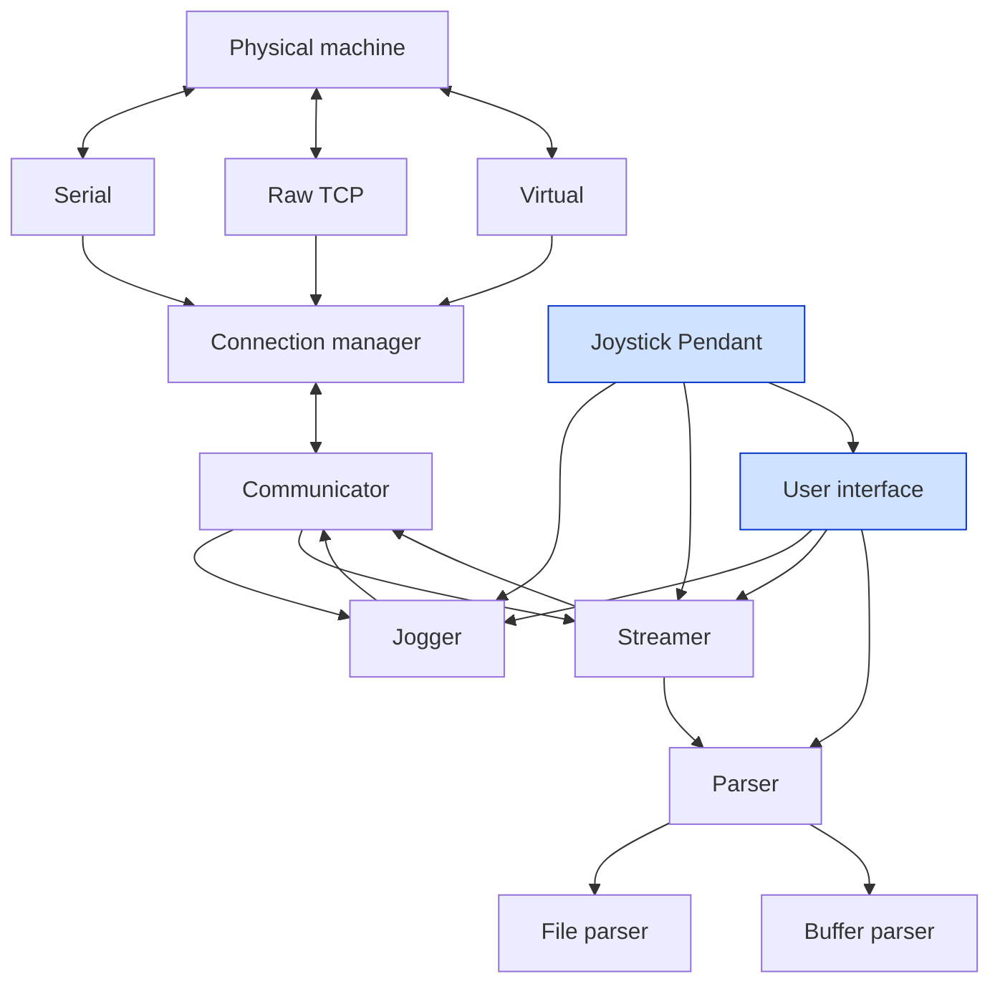
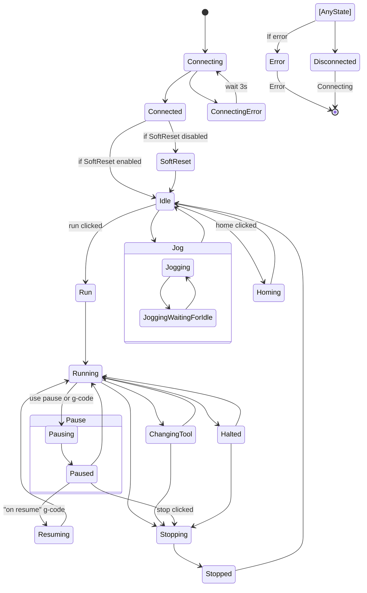
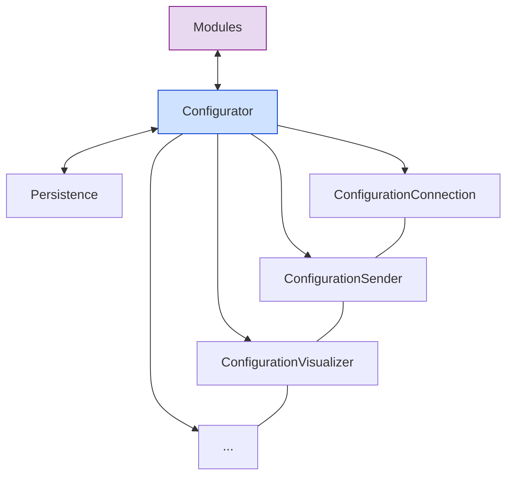

G-Pilot G-Code Sender
-----------

What G stands for?

- G-code Pilot: G-code is a programming language used to control CNC machines, so "G-Pilot" may suggest that the program is used for piloting or controlling using G-code.
- Guided Pilot: "G-Pilot" may also suggest that the program provides guidance or leads the user through processes related to CNC machining, similar to how a pilot guides an airplane.
- Global Pilot: This may suggest that the program offers solutions on a global scale, able to handle various types of CNC machines and be a versatile tool for controlling them.
- Genius Pilot: "G-Pilot" may suggest that the program is smart or advanced, similar to a pilot with high piloting skills.
- Graphical Pilot: If the program offers a graphical interface for controlling CNC machines, the name "G-Pilot" may suggest that it is a graphics-based tool.

*This fork is based on the Candle `experimental` branch. The main goal is to add joystick/joypad support. Other than that, I'm making improvements/bugfixes at my discretion.*

*Any help is welcome!*

What is G-Pilot?
-----------

GRBL/uCNC controller application with G-Code visualizer written in Qt.

Supported functions:
* Controlling GRBL-based cnc-machine via console commands, buttons on form, numpad.
* Monitoring cnc-machine state.
* Loading, editing, saving and sending of G-code files to cnc-machine.
* Visualizing G-code files.
* Camera
* Joystick/Joypad/Controller support.
* Customizable interface.
* uCNC/grblHAL virtual modes (cnc machine simulator).

## Download & Install (prerelease)

Automatic builds are available as a zip file and as an installer (created with Qt Installer Framework).

The latest version is always available here:
https://github.com/etet100/G-Pilot-GCode-Sender/releases/latest

**Note:** This is a prerelease version. The installer and builds are for testing and preview purposes only. There is still a lot of work to be done, but you can try it out and give feedback!

System requirements for running "G-Pilot":
-------------------

* Windows 10/Linux x86(not tested att all!)
* Graphics card with OpenGL 3.0 support
* 150 MB free storage space

Usefull links:

* https://github.com/Paciente8159/uCNC (modern firmware, inspired by Grbl and LinuxCNC)
* https://github.com/grbl/grbl (original GRBL firmware)
* https://github.com/grblHAL (modular, mostly compatible with GRBL)

Build requirements:
-------------------
Qt 6.8 with LLVM/Clang compiler (recommended) or MinGW/GCC 64bit compiler.
MSVC compiler is not officially supported and may not work correctly.

**Note:** The project uses QMake build system (gpilot.pro). CMake files (CMakeLists.txt) exist in the repository but are not maintained and may not work correctly.

Start with:

git clone --recurse-submodules https://github.com/etet100/G-Pilot-GCode-Sender

Command line options
-------------------

G-Pilot supports several command line switches:

- `-l` or `--log-to-file` – Enables logging debug info to GPilot.log file.
- `-t` or `--trim-log` – Clears GPilot.log file at startup (use with log-to-file).
- `-c` or `--config-type <type>` – Selects config file format. Available types: `ini`, `json`, `xml`. Default: `ini`.
- `-co` or `--console` - Opens G-Pilot with console window (for debugging purposes). Windows only.

Examples:

  G-Pilot.exe --log-to-file --trim-log --config-type json
  G-Pilot.exe --console

You can combine options as needed. See main.cpp for details.

Connection modes:
-----------------

G-Pilot supports the following connection modes:
* Serial port
* Raw TCP, uses exactly the same protocol as serial port mode, no additional handshaking is performed
* uCNC virtual mode, no real hardware needed
* grblHAL virtual mode, no real hardware needed


Architecture:
-------------

The original Candle was built in a way that was not transparent and difficult to modify. My version will be built modularly, in a way that is tentatively presented in the diagram below. One of the changes is the complete separation of the interface from the machine control logic. This has the following advantages:

* General transparency and manageability of the code
* The ability to quickly change the UI, even with the possibility of creating it in a * different technology
* Easier handling of new communication methods
* Much easier addition of new features
* Easier testing



Application states:
-------------------

The diagram below shows the possible states of the application. Transitions between states are triggered by events such as changing the state of the machine, clicking buttons, etc.



Configurations:
---------------

Another module begging for a rewrite is the configuration storage mechanism. Of course, it will be detached into a separate module. Settings sets will be wrapped in separate classes. The reading and writing of fields will be partially automated. Persistence layer will be separated from the configuration logic. The configuration will be stored in a local file or in a cloud, for example Dropbox or Google Drive.



How to build (Windows, Qt, MinGW/LLVM)
-------------------

1. Clone the repository with submodules:
    ```
    git clone --recurse-submodules https://github.com/etet100/G-Pilot-GCode-Sender
    cd G-Pilot-GCode-Sender
    git submodule update --init --recursive
    ```

2. Build with Qt Creator (recommended):
    - Open `gpilot.pro` in Qt Creator.
    - Select Qt 6.x and LLVM/Clang compiler (recommended) or MinGW. MSVC is not supported.
    - To enable multi-threaded compilation for faster builds:
      - Go to Projects → Build → Build Steps → Make → Make arguments
      - Add `-j8` (adjust number based on your CPU cores)
    - Click Build (Ctrl+B).
    - The executable and DLL files will appear in the `bin` folder.

3. Build with qmake from command line:
    - Add Qt bin directory to your PATH:
      ```
      set PATH=C:\Qt\6.8.1\llvm-mingw_64\bin;%PATH%
      ```
    - Run qmake to generate Makefile:
      ```
      qmake gpilot.pro
      ```
    - Build the project:
      For LLVM/Clang (recommended) or MinGW:
      ```
      mingw32-make -j8
      ```
      The `-j8` flag enables parallel compilation with 8 threads - adjust the number based on your CPU cores for faster builds.

    - The executable and DLL files will be generated in the `bin` folder.

4. Packaging:
    - Copy files from the `bin` folder (exe, dll, translations, LICENSE).
    - Make sure all required DLLs are present (Qt, vendor DLLs).

If you have build errors, check that all submodules are updated and you are using the correct Qt version.

Building Qt Creator Designer Plugins
-------------------

G-Pilot includes custom Qt Designer widgets that can be used in Qt Creator. These plugins must be built with the same compiler used to build Qt Creator (typically MSVC 2022 64-bit).

**Important:** The main G-Pilot project uses a different compiler (LLVM/Clang or MinGW), so you need to build the designer plugins separately.

### Steps:

1. Open the designer plugins project:
   - In Qt Creator, open `src/designerplugins/designerplugins.pro` (not the main gpilot.pro)

2. Select the correct kit:
   - Use Qt 6.x with MSVC 2022 64-bit compiler (the same compiler used to build your Qt Creator)
   - Do NOT use LLVM/Clang or MinGW for this build
   - **Build in Release mode** - Qt Creator cannot load Debug plugins

3. Configure the installation path:
   - By default, plugins install to `C:/Programy/Qt/Tools/QtCreator/bin/plugins/designer`
   - To use a different path, configure it before building:
     ```
     qmake QTCREATOR_PLUGINS_PATH="C:/YourPath/QtCreator/bin/plugins/designer"
     ```
   - Or set it as an environment variable:
     ```
     set QTCREATOR_PLUGINS_PATH=C:/YourPath/QtCreator/bin/plugins/designer
     ```

4. Build and install:
   - Build the project (Ctrl+B)
   - Run `make install` or add an install step in Qt Creator:
     - Go to Projects → Build Settings → Build Steps
     - Add a Make step with argument: `install`

5. Restart Qt Creator to load the new plugins

The custom widgets (ColorPicker, Slider, SliderBox, StyledToolButton, and so on...) will now appear in the Qt Designer widget palette.

How it looks:

Main window:


Dark mode:


Heightmap preview:


Settings:


GRBL configurator:


