AstroCore G-Code Sender
-----------

What AstroCore stands for?

- **Astronaut's Core**: Like an astronaut at mission control, AstroCore puts you in the cockpit of your CNC machine with every gauge and button right at hand.
- **Astronomical Core**: Your CNC work deserves astronomical precision. AstroCore is the core engine that keeps every cut, move and probe on target.
- **Astro + Core**: "Astro" brings the reach of the stars — modern, scalable, ready for any supported firmware. "Core" is the central control unit that ties every module together.
- **Stellar Core**: Like the core of a star that powers everything around it, AstroCore is the beating heart of your workshop.
- **A Smart, Trusted, Reliable, Open Core**: A nerdy backronym we stand by — free, open source, and smart in the details.

*Any help is welcome!*

Documentation
-------------

Online documentation is available at:
https://etet100.github.io/AstroCore-GCode-Sender/

What is AstroCore?
----------------

GRBL/uCNC/FluidNC controller application with G-Code visualizer written in Qt.

Supported functions:
* Controlling GRBL-based cnc-machine via console commands, buttons on form, numpad.
* Monitoring cnc-machine state.
* Loading, editing, saving and sending of G-code files to cnc-machine.
* Visualizing G-code files.
* Camera
* Joystick/Joypad/Controller support.
* Customizable interface.
* uCNC/grblHAL/FluidNC virtual modes (cnc machine simulator).

User Interface
--------------
The main user interface consists of a single window that contains all the controls needed to operate the machine. You can see the loaded program (G-code), a visualizer, machine state display, heightmap management, and all other important controls in one place. The layout is designed to be clear and easy to use, so you can quickly access every function you need.

The size of interface elements can be adjusted to fit your screen resolution. You can scale the interface from 80% to 140%, which is equal to font sizes from 8 to 14. You can change the scale in the settings panel, in the `view` menu of the main window, or by using the keyboard shortcuts `Ctrl+` (to increase) or `Ctrl-` (to decrease) the scale. Scale changes take effect immediately.

## G-code Editing

After loading, the G-code can be edited directly in the program. You can edit a single line in place, edit a range of lines, add one or more new lines, or delete lines. After each edit, the preview updates immediately.

For editing multiple lines, a simple editor with syntax highlighting is available.

You can also save the edited file at any time.

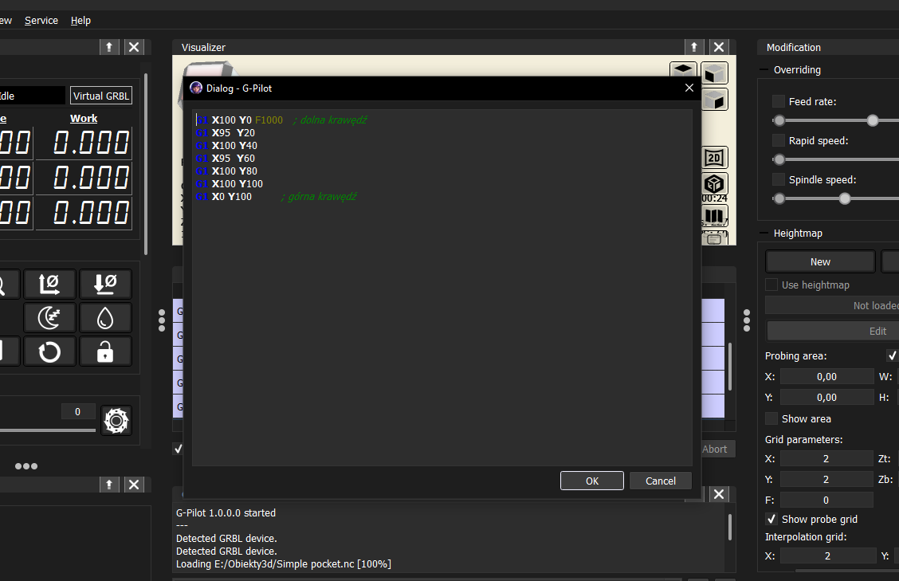

## Download & Install (prerelease)

Automatic builds are available as a zip (portable) file and as an installer (created with Qt Installer Framework).

The latest version is always available here:
https://github.com/etet100/AstroCore-GCode-Sender/releases/latest

Each release contains both **Debug** and **Release** versions:

- **Debug Build** (`AstroCodePortable-debug.zip`, `AstroCodeInstaller-debug.exe`):
  - Includes debugging symbols and additional logging
  - Larger file size but better for troubleshooting issues
  - Recommended for testing and reporting bugs

- **Release Build** (`AstroCodePortable-release.zip`, `AstroCodeInstaller-release.exe`):
  - Optimized for performance with smaller file size
  - Recommended for normal usage

**Note:** This is a prerelease version. The installer and builds are for testing and preview purposes only. There is still a lot of work to be done, but you can try it out and give feedback!

System requirements for running "AstroCore":
-------------------

* Windows 10/Linux x86(not tested att all!)
* Graphics card with OpenGL 3.0 support
* 150 MB free storage space

Usefull links:

* https://github.com/Paciente8159/uCNC (modern firmware, inspired by Grbl and LinuxCNC)
* https://github.com/grbl/grbl (original GRBL firmware)
* https://github.com/grblHAL (modular, mostly compatible with GRBL)
* https://github.com/bdring/FluidNC (firmware for ESP32, compatible with GRBL)

Build requirements:
-------------------
Qt 6.8 with LLVM/Clang compiler (recommended) or MinGW/GCC 64bit compiler.
MSVC compiler is not officially supported and may not work correctly.

**Note:** The project uses QMake build system (gpilot.pro). CMake files (CMakeLists.txt) exist in the repository but are not maintained and may not work correctly.

Start with:

git clone --recurse-submodules https://github.com/etet100/AstroCore-GCode-Sender

Command line options
-------------------

AstroCore supports several command line switches:

- `-l` or `--log-to-file` – Enables logging debug info to AstroCode.log file.
- `-t` or `--trim-log` – Clears AstroCode.log file at startup (use with log-to-file).
- `-c` or `--config-type <type>` – Selects config file format. Available types: `ini`, `json`, `xml`. Default: `ini`.
- `-co` or `--console` - Opens AstroCore with console window (for debugging purposes). Windows only.
- `-lw` or `--log-wnd` - Opens AstroCore with log browser window.

Examples:

  AstroCode.exe --log-to-file --trim-log --config-type json
  AstroCode.exe --console

You can combine options as needed. See main.cpp for details.

Connection modes:
-----------------

AstroCore supports the following connection modes:
* Serial port
* Raw TCP, uses exactly the same protocol as serial port mode, no additional handshaking is performed
* uCNC virtual mode, no real hardware needed
* grblHAL virtual mode, no real hardware needed
* FluidNC virtual mode, no real hardware needed


Architecture:
-------------

The original Candle was built in a way that was not transparent and difficult to modify. My version will be built modularly, in a way that is tentatively presented in the diagram below. One of the changes is the complete separation of the interface from the machine control logic. This has the following advantages:

* General transparency and manageability of the code
* The ability to quickly change the UI, even with the possibility of creating it in a * different technology
* Easier handling of new communication methods
* Much easier addition of new features
* Easier testing

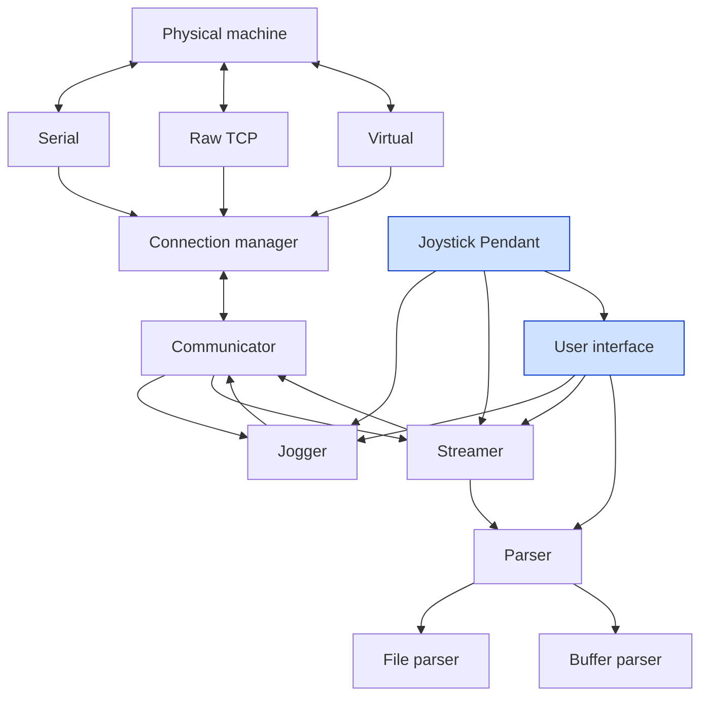

Log browser window:
-------------------

AstroCore includes a custom log browser window that allows you to view and filter log messages generated by the application. The log browser provides an easy way to monitor the application's behavior, debug issues, and analyze events.

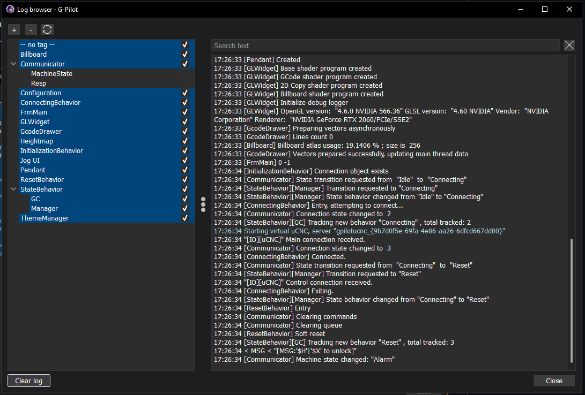

Application states:
-------------------

Each state is managed by a dedicated behavior class in [src/gpilot/core/state_behavior/](src/gpilot/core/state_behavior/). The state machine itself is managed by `StateBehaviorManager`.

There are two kinds of transitions:
- **Replace** — current state is destroyed and a new one starts.
- **Suspend [S]** — current state is paused and pushed to a stack; the new state runs on top. When it finishes, the previous state is restored.

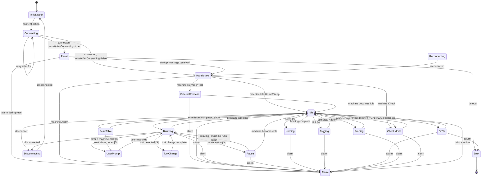

Configurations:
---------------

Another module begging for a rewrite is the configuration storage mechanism. Of course, it will be detached into a separate module. Settings sets will be wrapped in separate classes. The reading and writing of fields will be partially automated. Persistence layer will be separated from the configuration logic. The configuration will be stored in a local file or in a cloud, for example Dropbox or Google Drive.

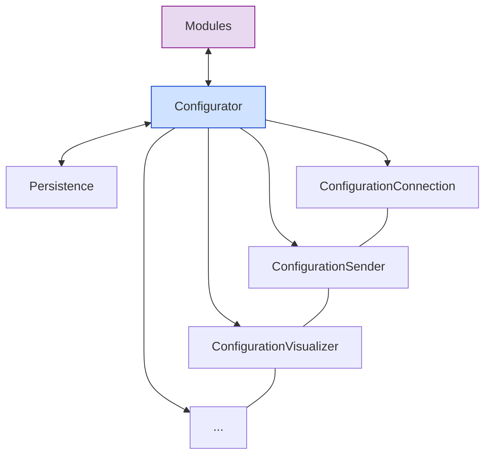

How to build (Windows/Linux, Qt, MinGW/LLVM)
-------------------

1. Clone the repository with submodules:
    ```
    git clone --recurse-submodules https://github.com/etet100/AstroCore-GCode-Sender
    cd AstroCore-GCode-Sender
    git submodule update --init --recursive
    ```

2. Build qCoro dependency:

    qCoro is a C++ library that provides coroutine support for Qt. It must be built before building AstroCore.

    - **Automated build (recommended):**

      Run the build script from the project root:

      Windows:
      ```
      scripts\build_qcoro.bat
      ```

      Linux:
      ```bash
      chmod +x scripts/build_qcoro.sh
      ./scripts/build_qcoro.sh
      ```

      This will configure, build, and install qCoro to `src/vendor/qcoro/install`.

    - **Manual build:**

      If you prefer to build manually or need custom options:

      Windows:
      ```
      cd src\vendor\qcoro
      cmake -B build -S . -G Ninja -DQCORO_WITH_QTWEBSOCKETS=OFF -DBUILD_TESTING=OFF -DQCORO_BUILD_EXAMPLES=OFF
      cmake --build build
      cmake --install build --prefix install
      cd ..\..\..
      ```

      Linux:
      ```bash
      cd src/vendor/qcoro
      cmake -B build -S . -DQCORO_WITH_QTWEBSOCKETS=OFF -DBUILD_TESTING=OFF -DQCORO_BUILD_EXAMPLES=OFF
      cmake --build build -- -j$(nproc)
      cmake --install build --prefix install
      cd ../../..
      - Add `-j8` (adjust number based on your CPU cores)
    - Set auto-copy of DLL files after build:
      - Under Projects → Build Settings or Deploy Settings → Build Steps, add a Custom Process Step:
        - Command: `python`
        - Arguments: `copy_files.py %{ActiveProject:BuildConfig:Path} %{ActiveProject:BuildConfig:Path}\src\gpilot\`
        - Working directory: `%{ActiveProject:ProjectDirectory}\scripts`
    - Click Build (Ctrl+B).
    - The executable and DLL files will appear in the `bin` folder.

4. Build with qmake from command line:
    - Add Qt bin directory to your PATH:
      ```
      set PATH=C:\Qt\6.8.1\llvm-mingw_64\bin;%PATH%
      ```
    - Run qmake to generate Makefile:
      ```
      qmake gpilot.pro
      ```
    - Build the project:
      For LLVM/Clang (recommended) or MinGW:
      ```
      mingw32-make -j8
      ```
      The `-j8` flag enables parallel compilation with 8 threads - adjust the number based on your CPU cores for faster builds.

    - The executable and DLL files will be generated in the `bin` folder.

5. Packaging:
    - Copy files from the `bin` folder (exe, dll, translations, LICENSE).
    - Make sure all required DLLs are present (Qt, vendor DLLs).

If you have build errors, check that all submodules are updated and you are using the correct Qt version.

Building Qt Creator Designer Plugins
-------------------

AstroCore includes custom Qt Designer widgets that can be used in Qt Creator. These plugins must be built with the same compiler used to build Qt Creator (typically MSVC 2022 64-bit).

**Important:** The main AstroCore project uses a different compiler (LLVM/Clang or MinGW), so you need to build the designer plugins separately.

### Steps:

1. Open the designer plugins project:
   - In Qt Creator, open `src/designerplugins/designerplugins.pro` (not the main gpilot.pro)

2. Select the correct kit:
   - Use Qt 6.x with MSVC 2022 64-bit compiler (the same compiler used to build your Qt Creator)
   - Do NOT use LLVM/Clang or MinGW for this build
   - **Build in Release mode** - Qt Creator cannot load Debug plugins

3. Configure the installation path:
   - By default, plugins install to `C:/Programy/Qt/Tools/QtCreator/bin/plugins/designer`
   - To use a different path, configure it before building:
     ```
     qmake QTCREATOR_PLUGINS_PATH="C:/YourPath/QtCreator/bin/plugins/designer"
     ```
   - Or set it as an environment variable:
     ```
     set QTCREATOR_PLUGINS_PATH=C:/YourPath/QtCreator/bin/plugins/designer
     ```

4. Build and install:
   - Build the project (Ctrl+B)
   - Run `make install` or add an install step in Qt Creator:
     - Go to Projects → Build Settings → Build Steps
     - Add a Make step with argument: `install`

5. Restart Qt Creator to load the new plugins

The custom widgets (ColorPicker, Slider, SliderBox, StyledToolButton, and so on...) will now appear in the Qt Designer widget palette.

How it looks:

Main window:


Dark mode:


New style dark mode - scaled view:


Heightmap preview:


Heightmap with height markers:

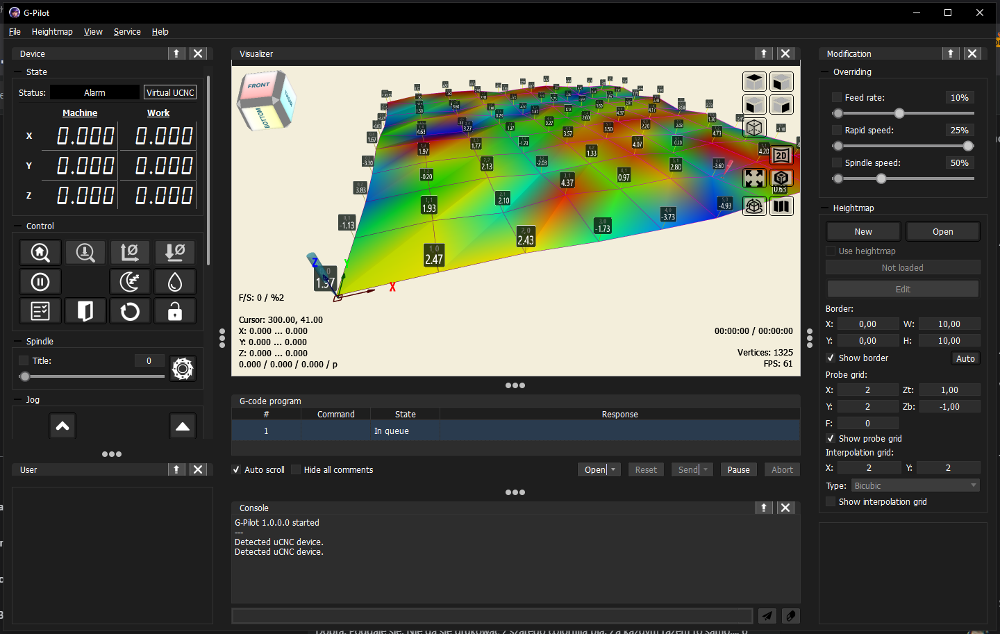
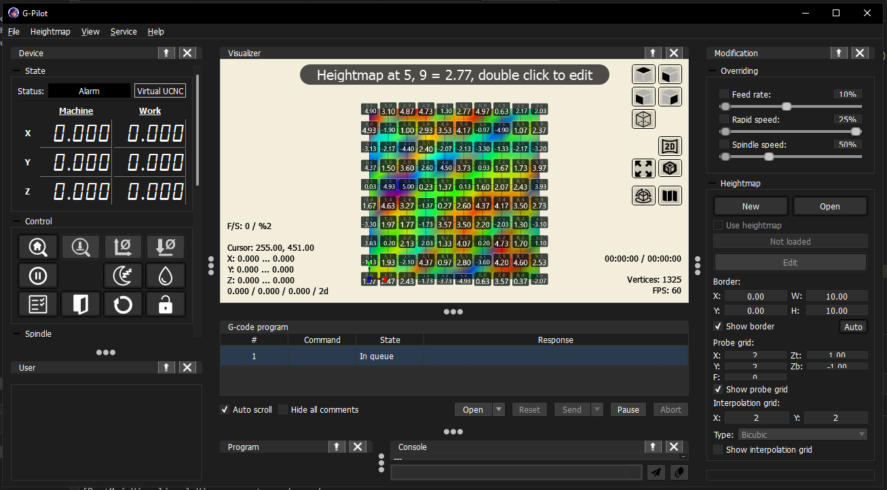

Settings:

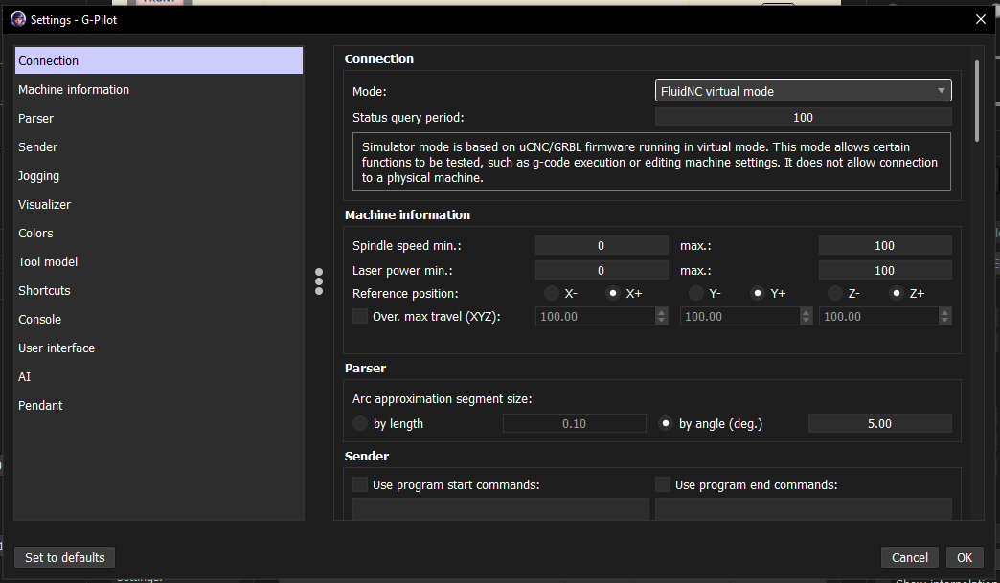

GRBL configurator:

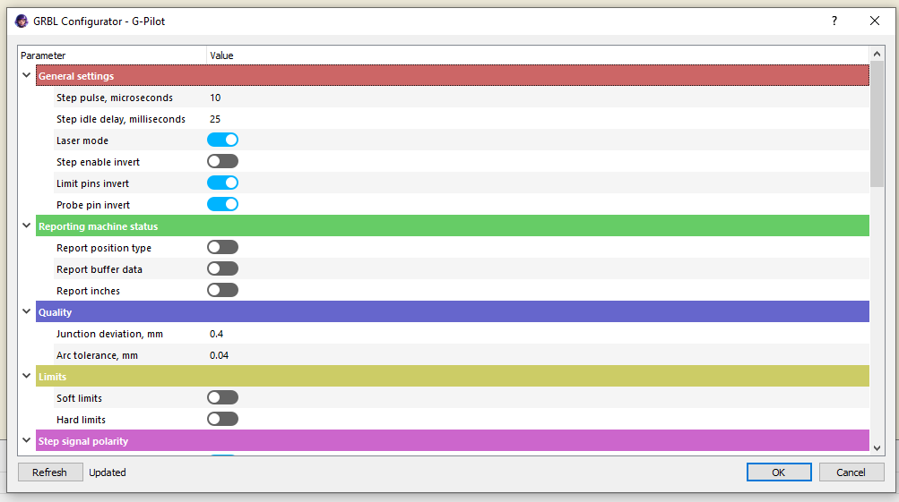

Heightmap
-------------------

AstroCore uses a custom text-based format for storing table surface height measurements. This format allows for compensation of uneven work surfaces during machining operations.

### File Structure (.map)

The heightmap file consists of three main sections:

1. **Version** - File format version identifier
2. **Parameters** - Grid configuration and measurement settings
3. **Data** - Height measurements organized in rows

### Format Specification

```
# g-pilot heightmap
version: 1

# params
size: <cols> <rows>
startPos: <x> <y>
stepSize: <dx> <dy>

# data (row = Y, col = X)
row: <z1> <z2> <z3> ... <zn>
row: <z1> <z2> <z3> ... <zn>
...
```

**Parameters:**
- `version` - Format version number (currently 1)
- `size` - Number of columns and rows in the measurement grid
- `startPos` - Starting position coordinates (X, Y) in millimeters
- `stepSize` - Distance between measurement points (X, Y) in millimeters

**Data:**
- Each `row:` line contains height (Z) values for all columns in that row
- Values are space-separated floating-point numbers in millimeters
- Rows are ordered from Y=0 to Y=max
- Within each row, columns are ordered from X=0 to X=max

### Example

```
# g-pilot heightmap
version: 1

# params
size: 10 10
startPos: 0 0
stepSize: 5 5

# data (row = Y, col = X)
row: -3.63 0.57 -3.87 -1.67 3.97 -0.87 -2.4 3.6 3.73 0.47
row: -3.9 2.17 -0.37 3.6 1.8 -4.0 0.9 1.87 0.77 1.2
...
```

This example defines a 10×10 grid starting at position (0, 0) with 5mm spacing between measurement points.

### Interpolation Methods

The measured table curvature can be interpolated at any point using one of three methods:

- **Linear** - Simple linear interpolation between adjacent points
- **Bilinear** - Two-dimensional linear interpolation using four surrounding points
- **Bicubic** - Smooth interpolation using sixteen surrounding points for more accurate surface representation

Heightmap rendering with bilinear and bicubic interpolation:

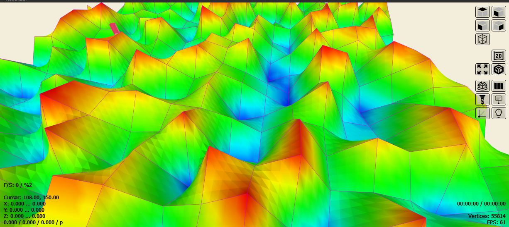
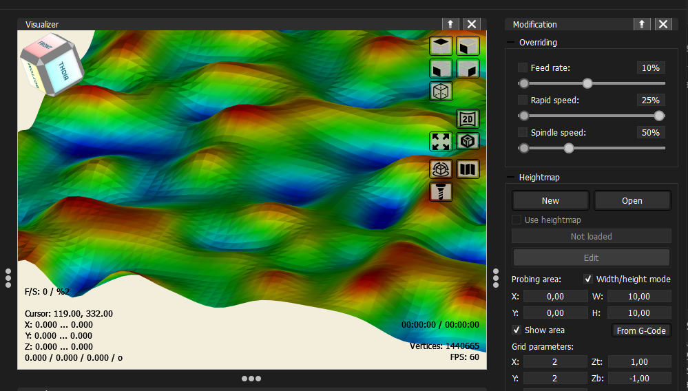
